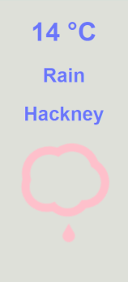

# ⛅ weather-app

**weather-app** is a simple app built with Expess, Node.js and EJS for templating.

It uses the OpenWeather API, the browser geolocation and animated skycons.

## Installation

Clone the project and use the package manager npm to install weather-app and its dependencies.

```bash
cd to-do-list
npm install
node app.js
```

## Usage

  
* The location is detected by the built-in geolocation from the browser.
* The temperature in Celsius is displayed.
* An animated skycon is displayed.

## Contributing
weather-app has been built to learn the basics of full-stack web development.  
To do:
- [x] connect to the API cleanly
```
const request = require("request");
```
- [x] hide the API key in .gitignore and be able to call it
```
const fs = require("fs");
let apiKey = "";
fs.readFile('api-key.txt', function(err, data) {
    if (err) {
        throw err;
    }
    apiKey = data;
});
```
- [x] use the geolocation from the browser in Node.js by adding a script tag in the html file
- [x] use the skycons by adding a script tag in the html file, this script tag need to be at the end of the html file, otherwise the result will not be rendered
- [x] map the skycons to the results from the API using 
```
<input type="hidden></input>
```
- [ ] figure out how to use the geolocation from the browser without using two html pages and one redirection

## License
[MIT](https://choosealicense.com/licenses/mit/)